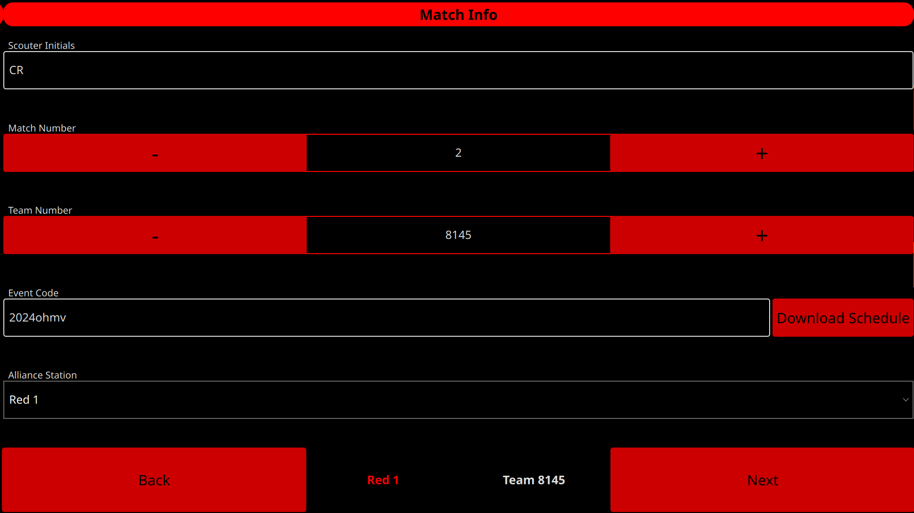
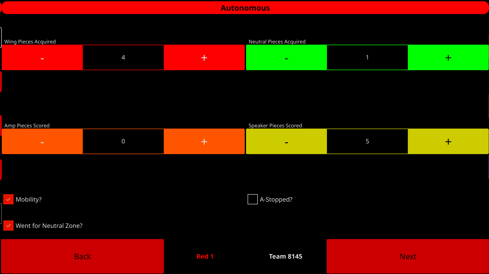
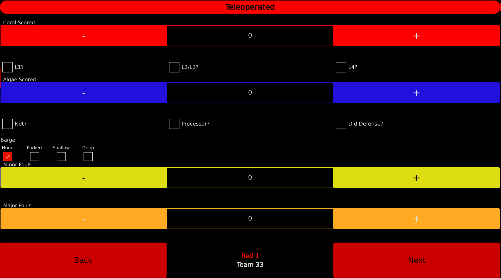
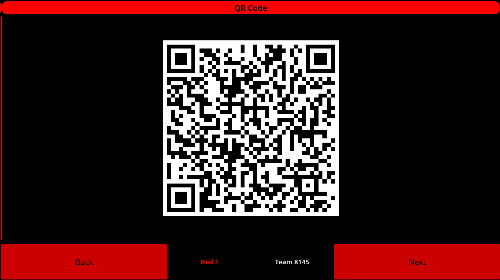
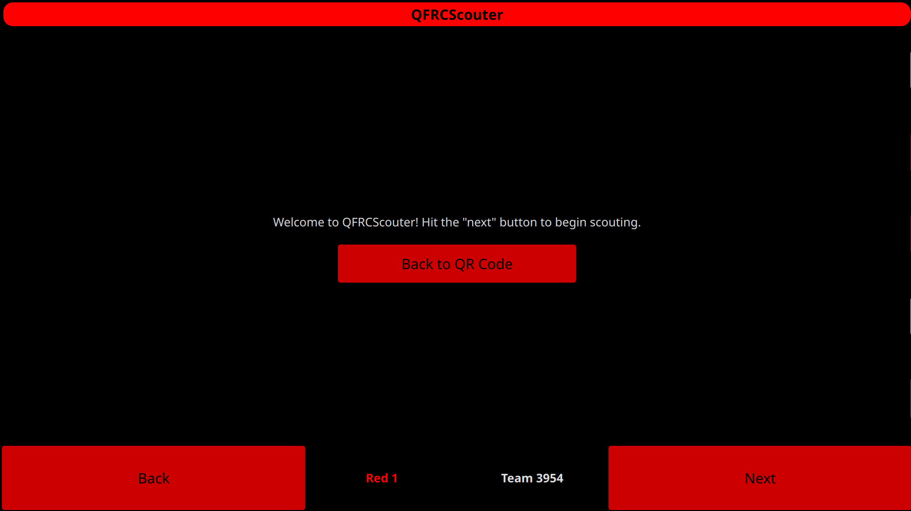
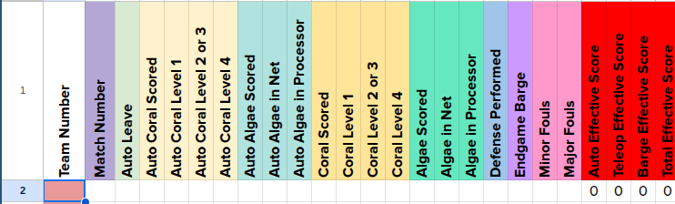
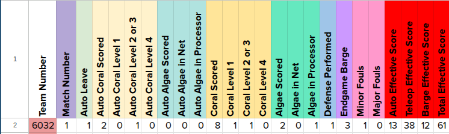
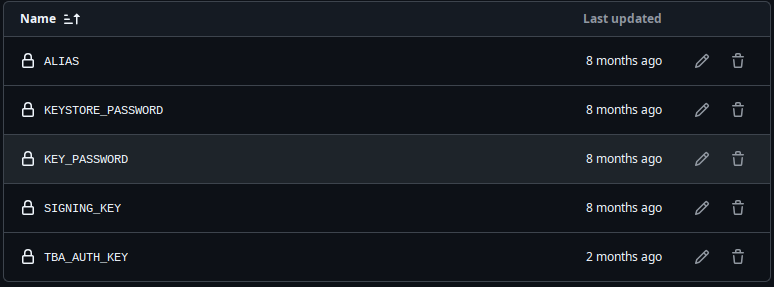

# QFRCScouter
A powerful, cross-platform, QR-based, configurable scouting app for FRC, designed to be simple-to-use for scouters and modular for developers and hosters.

## Usage

### Team Info
Usage of QFRCScouter begins on the "Team Info" page. If not on the web app, the user needs to have the schedule downloaded; see "Schedule" below.

The match number is next, which can be incremented and decremented with the plus and minus buttons.

Finally, if the schedule is set up properly, the scouter can set the alliance station they plan to scout. The scouting app will automatically set the team number for each match. The selected station & team number will always be displayed at the bottom.



### Auto Data
Scouting for autonomous data begins. Press the plus and minus buttons on each of the relevant fields as needed, and select the checkboxes at the end of the autonomous period as needed.



### Teleop Data
Scouting for teleop & endgame data begins. Operation here is identical to Auto scouting.



### QR Code
You're done! Present your QR code to the scanner to be put into the spreadsheet. Once done, press "Next". This will bring you to the beginning, and increment the match number, selecting the correct team for your alliance station.



If the scan failed and you already pressed "Next", OR if you wish to change some data, press "Back to QR Code" on the first page.



### Input Data
On a computer with the SPAMalytics sheet open, plug in a USB QR scanner. Hover your mouse over a blank "Team Number" section.



Scan the QR code from the scouting device and all the data will be automatically input.



## Self-Hosting

### Start
First, fork the repo.

Next, you'll need to enable GitHub Pages -- go to your repo Settings -> Pages -> Branch, and select the master branch.

Next, go to Secrets and Variables -> Actions -> Repository Secrets.

Now, add a secret named `TBA_AUTH_KEY`. Go to https://thebluealliance.com, then to your account settings. Create or log into an account. Scroll down to "Read API Keys", and add a new key. Copy this key, and put it into the `TBA_AUTH_KEY` secret.

If you plan to put out release builds, then you will need to set up an Android Keystore & the secrets for it. See https://github.com/r0adkll/sign-android-release for info on each of the variables.

Your final secrets should look like this:



Push any desired changes (config, schedule, etc) and your page will be hosted at https://\<yourName\>.github.io/Scouter. You can access native builds in the Actions tab of your repository.

### Schedule
The match schedule can be downloaded at any time and kept offline for native platforms, by entering the relevant event code into the "Event Code" box on the "Team Info" page and pressing Download. Once downloaded once, it doesn't need to be downloaded again on future runs unless it's a different event.

For the web app, the included match schedule is used. This schedule can be updated with the `getSchedule.sh` script. Syntax:

```
./getSchedule.sh <eventCode> <TBA auth key>
```

Then push these changes to your fork and your GitHub pages will have the match schedule built-in.

Once the schedule is all set, scouters can select an alliance station to use. The scouter will automatically select the proper team number for each match depending on your selected station.

### Multi-platform
QFRCScouter has several platforms it can run on:

- Windows
- Linux
- Android
- Web

The web app is available directly through this repo's GitHub pages. If you wish to provide your own config, you can fork this repository, update the config.json (according to the Configuration section below), and GitHub actions will take care of the rest--ensure to enable Pages in the repository settings.

Furthermore, the web app can be downloaded and run locally; go the the [latest actions run](https://github.com/Q-FRC/Scouter/actions), download the `github-pages` artifact, and open `index.html` in your browser. This is completely offline!

Linux, Android, and Windows users are encouraged to use the native options, however.

### Configuration
QFRCScouter is configurable through a simple JSON file. The format is described below.

- `welcome` (str): The welcome notice that shows up on the first page of the app.
- `button` (color): The accent color of most of the buttons present in the app.
- `buttonPressed` (color): What color most of the buttons will be when pressed down.
- `buttonText` (color): The text color of most of the buttons present in the app.
- `backgroundColor` (color): The color of the background of the application.
- `accent` (color): The accent of some small parts of the application.
- `qmlAccent` (color): The QML accent used for certain UI elements. See the table at the bottom for options.
- `textColor` (color): The color of most of the text of the application.
- `pages` (obj): Describes the data present in the auto, teleop, and scale pages.
    * `auto` (obj) & `tele` (obj): Contains data present in the auto and teleop data pages.
        - `columns` (int): The number of columns on the page (default 2).
        - `data` (arr): The actual data to use.
            - `type` (str): either `"bool"`, `"int"`, or `"string"` for a checkbox, spin box, or list of checkboxes, respectively.
            - `text` (str): The text shown next to the spinbox or checkbox.
            - `columns` (int): How many columns this should take up.
            - `int` fields:
                * `color` (color): The accent color of the button, useful for quick differentiation for scouters.
                * `textColor` (color): The color of the text of the button.
                * `min` (int): The minimum value.
                * `max` (int): The maximum value.
            - `string` fields:
                * `choices` (string list): What choices to present in the list.

Available QML accents:


